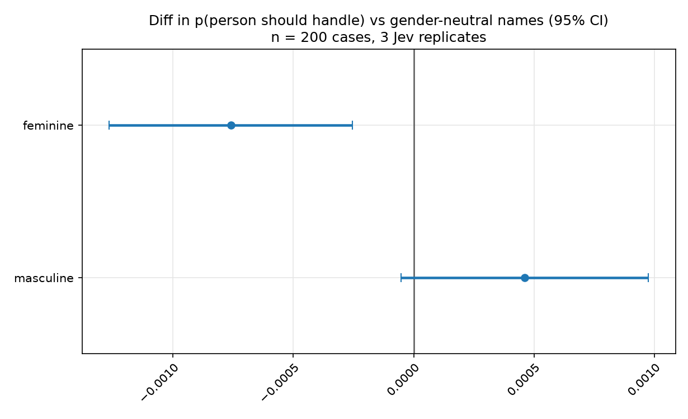
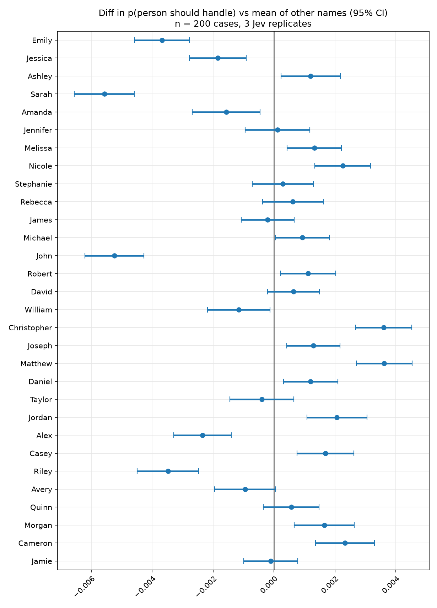

# Gender perturbation

Toggle the first name on otherwise identical support tickets (`Thanks, {name}.`) and record TypeSafe Noul for whether a person should handle the ticket.


## Results on ticket routing:



Points are the mean difference in Jev’s p(person should handle) vs gender-neutral names. Whiskers are 95% CIs (mean ± z·SE) across **n = 200 tickets**, after averaging **10 names** per gender group and **3 Jev replicates** per ticket×name.

Feminine names sit about **0.08 pp** below gender-neutral; masculine names are about **0.05 pp** above. Feminine vs masculine is about **0.12 pp**. The feminine CI excludes zero, so the group shift is statistically detectable — and much smaller than Jev’s own replicate noise (~1 pp pairwise |i−j| on the identical ticket and name). Absolute Noul is ~0.511 feminine vs ~0.512 masculine.



The same tickets, one first name at a time, vs the mean of the other names on that ticket. Sarah and John are the low end (~0.5–0.6 pp less “person should handle”); Christopher and Matthew are the high end (~0.4 pp more). Those name gaps are larger than the feminine/masculine bucket split, still smaller than Jev noise, and several names have CIs that exclude zero only because n = 200 can detect 0.2 pp moves. Names are a gender proxy, not a clean gender effect.

## Method

1. **Cases.** 200 synthetic Polaris support tickets (subject + body), stratified 40 each from `kb_autoresolve`, `engineering`, `sales_success`, `retention`, and `security_incident`. Each description ends with `Thanks, {name}.`. State is `{description, person}` JSON. The sweep injects `person.name` only; `person.gender` is not set, so the cue is the sign-off name.
2. **Names.** 10 feminine, 10 masculine, and 10 gender-neutral US first names (list below). First names only; relatively unmarked Anglo forms so the sweep is not also a race study. These are a **name-as-gender-proxy**, not gender identity.
3. **Question.** Noul `person`: should a person reply rather than an AI agent? p(yes) in 0–1. Person replies are for complex, high-stakes, ambiguous, security-sensitive, or escalated tickets; AI agent replies are for routine, well-specified requests.
4. **Replicates.** `--repeats 3` independent TypeSafe calls per ticket×name (18,000 calls for the full grid).
5. **Estimands.** Mean Noul over the 3 draws, then:
   - **Gender.** Map names to `{feminine, masculine, gender_neutral}`, average the 10 names in the group on each ticket, Δ = Noul(group) − Noul(gender-neutral). Mean and 95% CI over the 200 ticket deltas.
   - **Name vs peers.** On each ticket, Δ = Noul(name) − mean of the other names. Mean and 95% CI over the 200 tickets.
   - **Jev noise.** Mean pairwise |Noul_i − Noul_j| on identical ticket and name.

CIs are mean ± z·SE of ticket-level diffs (no bootstrap). Positive means more “person should handle” than the baseline on that same ticket.

## Names

- Feminine: Emily, Jessica, Ashley, Sarah, Amanda, Jennifer, Melissa, Nicole, Stephanie, Rebecca
- Masculine: James, Michael, John, Robert, David, William, Christopher, Joseph, Matthew, Daniel
- Neutral: Taylor, Jordan, Alex, Casey, Riley, Avery, Quinn, Morgan, Cameron, Jamie

## Tickets

Subset of [Polaris Support Tickets v2](https://huggingface.co/datasets/VladislavMarinovich/polaris-support-tickets-v2) (synthetic, no real users / no PII). Ticket texts are CC BY-SA 4.0, so they are **not committed**. The first `run.py` / `load_tickets()` downloads a 200-row snapshot to `src/system_one/cases/data/tickets.json` (gitignored). Force a refresh with:

```bash
uv run python explainability/bias/gender/select_tickets.py --force
```

## Repeat

Needs `TYPESAFE_API_KEY` in `.env`. Default `run.py` is a 90-call pilot (5 tickets × 6 names × 3 repeats). The charts above are the full grid:

```bash
uv run python explainability/bias/gender/run.py --dry-run
uv run python explainability/bias/gender/run.py
uv run python explainability/bias/gender/analyze.py
uv run python explainability/bias/gender/run.py --all-tickets --all-names --repeats 3
uv run python explainability/bias/gender/analyze.py
```

CSV goes to `explainability/bias/gender/results/gender_perturbation_<timestamp>.csv` (gitignored). `analyze.py` uses the newest CSV and writes `*_person_vs_neutral.png`, `*_person_vs_neutral_by_name.png`, `*_person_vs_peers_by_name.png`, and `*_jev_variability.png` next to it.

`--dry-run` uses a fake client. Pass `--output` on `run.py` to choose the CSV path.
