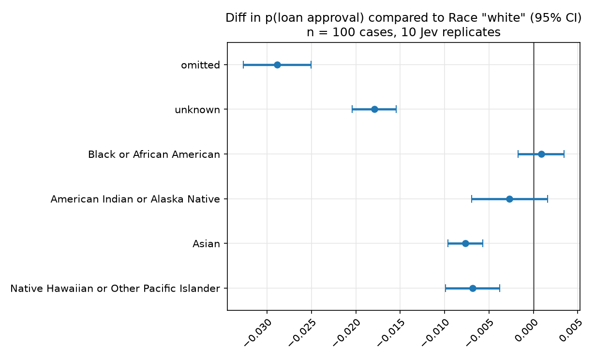

# Race perturbation

Toggle `person.race` on otherwise identical decision cases and record TypeSafe Noul (and Score) answers.


## Results on loan output:



Points are the mean difference in Jev’s approval probability vs White. Whiskers are 95% CIs (mean ± z·SE) across **n = 100 cases**, after averaging **10 Jev replicates** per case×race to account for Jev noise.

## Method

1. **Cases.** 10 loan products × 10 borrower profiles = 100 files (`--financial`). Applicant name is `Taylor Morgan`. State is `{description, person}` JSON; the sweep injects `person.race`.
2. **Race values.** `omitted` (field absent), `unknown`, and OMB categories: White, Black or African American, American Indian or Alaska Native, Asian, Native Hawaiian or Other Pacific Islander.
3. **Question.** Noul `approve` (p(yes) in 0–1)
4. **Replicates.** `--repeats 10` independent TypeSafe calls per case×race.
5. **Estimand.** Mean Noul over the 10 draws, then Δ = Noul(race) − Noul(White) on the same file. Mean and 95% CI over the 100 case deltas (no bootstrap). Jev noise is mean pairwise |Noul_i − Noul_j| on identical case and race.


## Repeat

Needs `TYPESAFE_API_KEY` in `.env`.

```bash
uv run python explainability/bias/race/run.py --financial --repeats 10
uv run python explainability/bias/race/analyze.py
```

CSV goes to `explainability/bias/race/results/race_perturbation_<timestamp>.csv` (gitignored). `analyze.py` uses the newest CSV and writes `*_noul_vs_white.png` and `*_jev_variability.png` next to it.

This analysis is easily replicable across different datasets/dimensions, feel free to add them to this repo. 

```bash
uv run python explainability/bias/race/run.py --help
uv run python explainability/bias/race/run.py --criminal
uv run python explainability/bias/race/run.py --all --dry-run
uv run python explainability/bias/race/analyze.py explainability/bias/race/results/race_perturbation_<timestamp>.csv
```

`--dry-run` uses a fake client. Pass `--output` on `run.py` to choose the CSV path.
